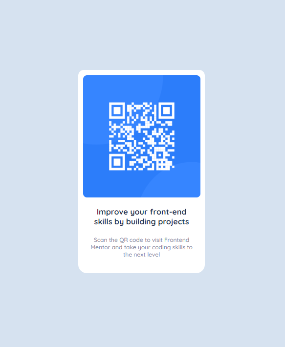

# Frontend Mentor - QR code component solution

Welcome everybody!👋🏼 This is my solution to my very first project ever! Don't be afraid to share your wisdom with me so i can learn from all of you! 💙 [QR code component challenge on Frontend Mentor](https://www.frontendmentor.io/challenges/qr-code-component-iux_sIO_H). 

## Table of contents

- [Overview](#overview)
  - [Screenshot](#screenshot)
  - [Links](#links)
  - [Built with](#built-with)
  - [Author](#author)

  
  

## Overview

### Screenshot

### Links

- Solution URL: [Add solution URL here](https://your-solution-url.com)
- Live Site URL: [Add live site URL here](https://your-live-site-url.com)

## My process

### Built with

- Semantic HTML5 markup
- CSS custom properties
- [Styled Components](https://styled-components.com/) - For styles

**Note: These are just examples. Delete this note and replace the list above with your own choices**

### What I learned

**Note: Delete this note and the content within this section and replace with your own learnings.**

### Continued development

### Useful resources

## Author

- Website - [Jero](https://www.jeronimojournade.com)
- Frontend Mentor - [@Artorias](https://www.frontendmentor.io/profile/ArtoriasDelAbismo)
- Twitter - [@JeroConOjotas](https://www.twitter.com/yourusername)

**Note: Delete this note and add/remove/edit lines above based on what links you'd like to share.**

## Acknowledgments

