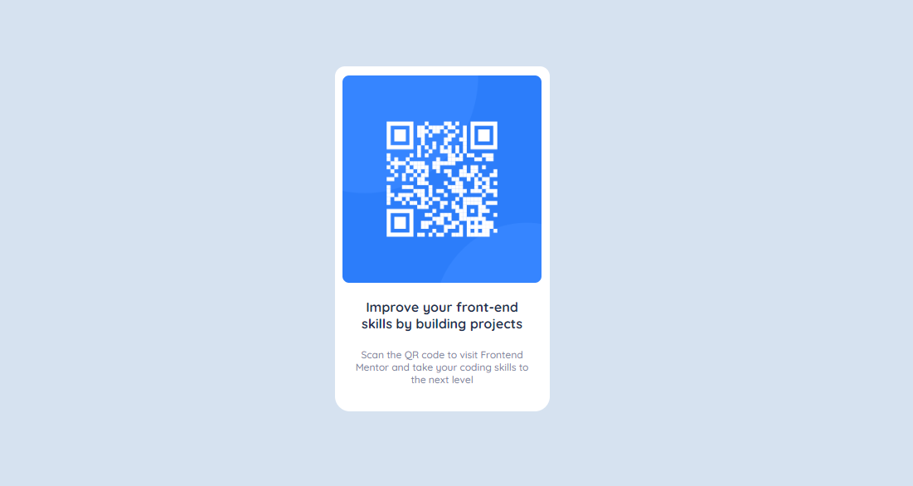

# Frontend Mentor - QR code component solution

Welcome everybody!👋🏼 This is my solution to my very first project ever! Don't be afraid to share your wisdom with me so i can learn from all of you! 💙 [QR code component challenge on Frontend Mentor](https://www.frontendmentor.io/challenges/qr-code-component-iux_sIO_H). 

## Table of contents

- [Overview](#overview)
  - [Screenshot](#screenshot)
  - [Links](#links)
  - [Built with](#built-with)
  - [Author](#author)

  
  

## Overview

### Screenshot

### Links

- Solution URL: [Coming soon](https://your-solution-url.com)
- Live Site URL: [Coming soon](https://your-live-site-url.com)

### Built with

- Semantic HTML5 markup
- CSS custom properties
- [Styled Components](https://styled-components.com/) - For styles

## Author

- Website - [www.jeronimojournade.com](https://www.jeronimojournade.com)
- Frontend Mentor - [@Artorias](https://www.frontendmentor.io/profile/ArtoriasDelAbismo)
- Twitter - [@JeroConOjotas](https://www.twitter.com/yourusername)

